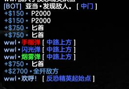

# CSGO-Text-Patch-tool
Easy tools to patch CSGO in game text  

## Usage
Clone and build project  
Move .jar to CSGO direcory  
run jar like <code>java -jar file.jar</code>. now Application will make default config in current Direcory

### TextPatch_Config

| Key | Description | Type |
| ----- | ----- | ----- |
| Patched_Lang_File | the Patched file will save for where | String |
| Default_Lang_File | wanna Patched Language file | String |
| Patch_Default_LangFile | if set True, Patched file will replace Default_Lang_File | Boolean |
| Color_Syntax | set Text color | Map |

###  TextPatch_Map
First, find Key in <code>Counter-Strike Global Offensive\csgo\resource\[Your Language File]</code>  
For example, Open file <code>Counter-Strike Global Offensive\csgo\resource\csgo_schinese.txt</code>  
Scroll down, find you wanna patched String, Copy First Text like <code>Game_radio_location</code>  
Write in TextPatch_Map.json file, Like this :  
<code>{  
"SFUI_TitlesTXT_HE_Grenade"                       :":red:高爆手雷",  
"SFUI_TitlesTXT_Flashbang"                        :":blue:闪光弹",  
"SFUI_TitlesTXT_Smoke_Grenade"                    :":green:烟雾弹",  
"SFUI_MolotovSlot"                                :":violet:燃烧瓶",  
"SFUI_DecoySlot"                                  :":white:诱饵弹",  
"SFUI_WPNHUD_Molotov"                             :":violet:燃烧瓶",  
"SFUI_WPNHUD_IncGrenade"                          :":violet:燃烧弹",  
"Game_radio_location"                             :"%s1 • %s3 :white:[:blue: %s2 :white:]"  
}
</code>

And save, Run app, now App will automatic patch language file, you can see it in game.  
#### if you wanna use Color code, just follow <code>Color_Syntax</code> setting

# 中文版本
一个简单的小工具, 用于修改游戏内的文本内容, 并且游戏更新后只需要重新生成  

## 使用方法
Clone这个项目 进行Build  
将jar文件移动到游戏根目录下  
运行jar文件 <code>java -jar file.jar</code>, 运行后应该会生成默认配置在当前目录下

### TextPatch_Config 文件

| Key | Description | Type |
| ----- | ----- | ----- |
| Patched_Lang_File | 修改后的文件保存位置 | String |
| Default_Lang_File | 想要修改的默认语言文件 | String |
| Patch_Default_LangFile | 如果设置为True,修改后的文件将直接写入Default_Lang_File | Boolean |
| Color_Syntax | 用于设置文本颜色格式化, 如果要修改需要同步修改map中的颜色文本 | Map |

###  TextPatch_Map 文件
首先, 在游戏目录下找到语言文件, 类似这样: <code>Counter-Strike Global Offensive\csgo\resource\csgo_schinese.txt</code>  
在里面搜索要修改的内容, 取文本前面的内容,类似: <code>Game_radio_location</code>  
将需要修改的内容写入TextPatch_Map文件中,就像这样 :  
<code>{  
"SFUI_TitlesTXT_HE_Grenade"                       :":red:高爆手雷",  
"SFUI_TitlesTXT_Flashbang"                        :":blue:闪光弹",  
"SFUI_TitlesTXT_Smoke_Grenade"                    :":green:烟雾弹",  
"SFUI_MolotovSlot"                                :":violet:燃烧瓶",  
"SFUI_DecoySlot"                                  :":white:诱饵弹",  
"SFUI_WPNHUD_Molotov"                             :":violet:燃烧瓶",  
"SFUI_WPNHUD_IncGrenade"                          :":violet:燃烧弹",  
"Game_radio_location"                             :"%s1 • %s3 :white:[:blue: %s2 :white:]"  
}
</code>

保存,重新运行jar文件,现在应该文本已经被替换了,打开游戏应该就可以看到效果了
#### 如果想要使用颜色代码, 使用 <code>Color_Syntax</code> 的设定即可

# this project used Google GSON